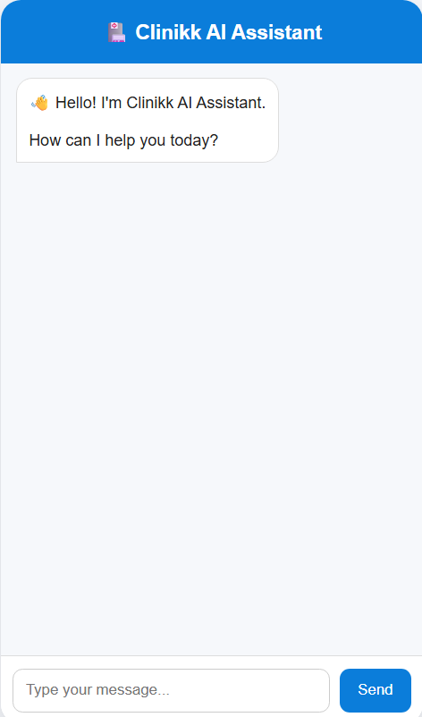
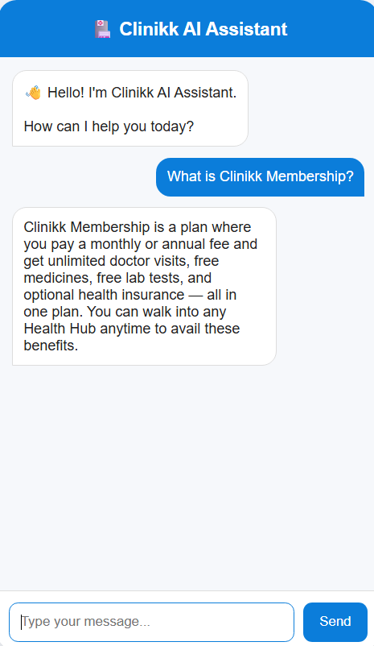
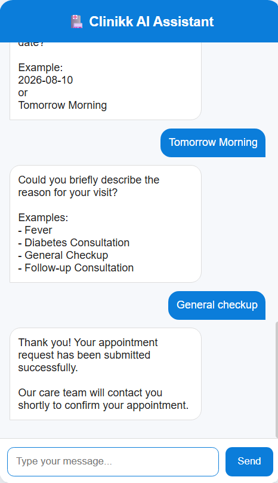

# 🏥 Clinikk AI Healthcare Assistant

An AI-powered healthcare assistant that answers Clinikk-related queries using Retrieval-Augmented Generation (RAG), assists patients with appointment booking, and captures qualified leads through a conversational workflow.

---

## 🚀 Features

- 🤖 AI chatbot powered by OpenAI
- 📚 RAG using FAISS and Clinikk website content
- 📅 Multi-step appointment booking
- 👤 Existing & New patient detection
- 📊 Lead scoring (0–100)
- 🔥 Hot / Warm / Cold lead classification
- 💬 Conversation history storage
- 📱 React frontend with FastAPI backend

---

## 🛠 Tech Stack

**Frontend**
- React
- Vite
- Axios

**Backend**
- FastAPI
- Python
- OpenAI
- LangChain
- FAISS

**Knowledge Base**
- BeautifulSoup
- Markdown
- Website Scraping

---

## 📂 Project Structure

```text
clinic-ai-agent/

├── backend/
├── frontend/
├── scraper/
├── knowledge/
├── rag/
├── data/
├── requirements.txt
└── README.md
```

---

## ⚙️ How It Works

```text
User
   │
   ▼
React Frontend
   │
   ▼
FastAPI Backend
   │
   ├──────────────┐
   ▼              ▼
RAG Chatbot   Appointment Flow
   │              │
   ▼              ▼
OpenAI GPT   Lead Scoring
                  │
                  ▼
          Local CRM (leads.json)
```

---

## 🌐 API Endpoints

| Method | Endpoint | Description |
|---------|----------|-------------|
| POST | `/chat` | AI chatbot & appointment booking |
| GET | `/leads` | View stored leads |
| GET | `/analytics` | Lead analytics |

---

## ▶️ Running the Project

### Backend

```bash
cd backend
pip install -r ../requirements.txt
uvicorn app:app --reload
```

### Frontend

```bash
cd frontend
npm install
npm run dev
```

---

## 📸 Screenshots

### Home Page



### AI Chatbot

> 

### Appointment Booking




---

## 🔮 Future Improvements

- Salesforce REST API integration
- PostgreSQL database
- Authentication
- Voice Assistant
- Cloud deployment

---

## 👨‍💻 Author

Developed as part of the **Clinikk AI Healthcare Assistant** using **FastAPI, React, OpenAI, LangChain, and FAISS**.
